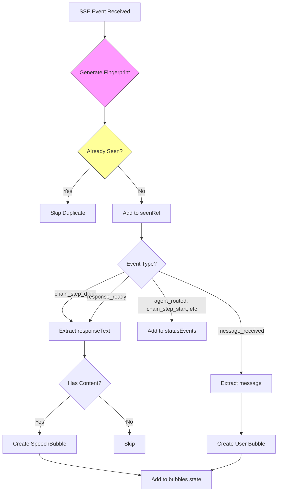
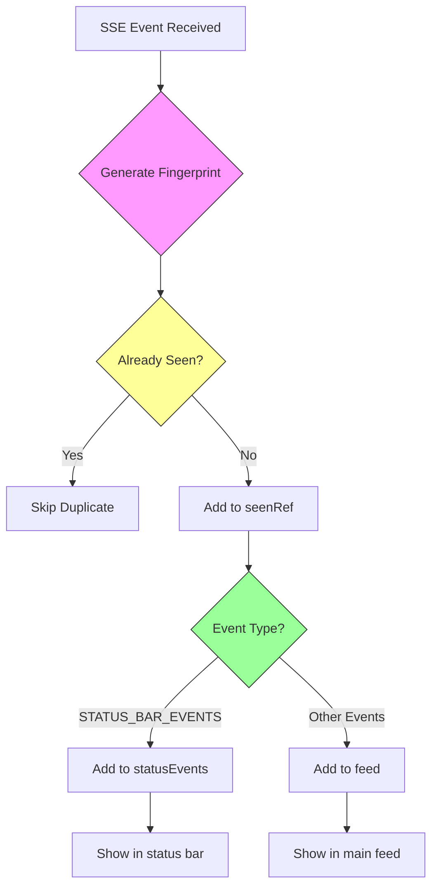
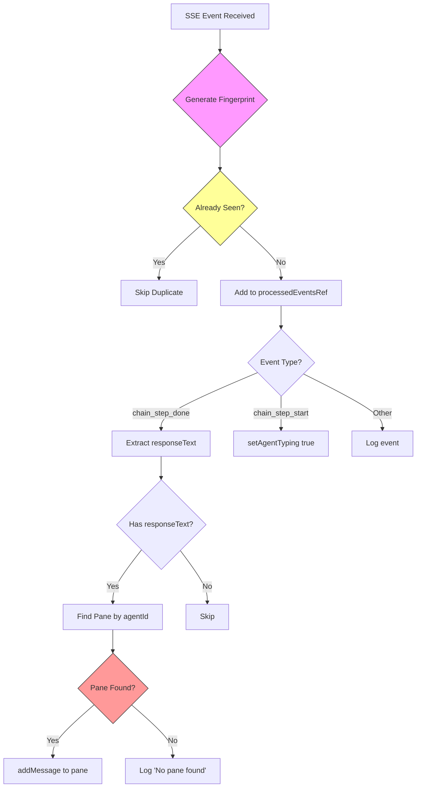

# TinyTUI vs TinyOffice Code Audit

## Architecture Comparison

### TinyOffice Event Handling (Office Page)



### TinyOffice Event Handling (Chat View)



### TinyTUI Current Event Handling



## Key Differences

### 1. Fingerprint Generation

| TinyOffice | TinyTUI |
|------------|---------|
| `${type}:${timestamp}:${messageId}:${agentId}` | `${type}:${messageId}:${agentId}` (NO timestamp) |

**Problem:** TinyTUI removed timestamp but this can cause issues if same event type fires multiple times without messageId

### 2. Event Handling Strategy

| TinyOffice | TinyTUI |
|------------|---------|
| Uses BOTH `chain_step_done` AND `response_ready` | Only uses `chain_step_done` |
| Routes to different UI components | All goes to panes |
| Status bar for chain events | No status bar separation |

### 3. Message Storage

| TinyOffice | TinyTUI |
|------------|---------|
| Global `bubbles` array | Per-pane `messages` array |
| Auto-expires after 15s | Persistent |
| All agents in one feed | Separate pane per agent |

### 4. Deduplication Scope

| TinyOffice | TinyTUI |
|------------|---------|
| Per-component `seenRef` | Shared `processedEventsRef` |
| Each component tracks own events | One global set |

## Root Cause of Missing Messages

Based on the logs:
```
[SSE] Duplicate event skipped: chain_step_done chain_step_done::kimi
```

The fingerprint is: `chain_step_done::kimi`

This means:
- `messageId` is empty/undefined
- `agentId` is "kimi"
- Type is "chain_step_done"

**The Problem:** When `chain_step_done` fires multiple times for the same agent in a conversation, they all have the same fingerprint (`chain_step_done::kimi`), so subsequent messages are incorrectly marked as duplicates!

## Solution

The fingerprint needs to include something unique per message. Options:
1. Add timestamp back (but this prevents dedup of true duplicates)
2. Use content hash (responseText)
3. Use conversationId + step number

TinyOffice's approach with timestamp works because they want to show every event, even if similar. TinyTUI wants to deduplicate actual duplicates.

**Recommended Fix:** Use content-based fingerprint for events without messageId:
```javascript
function getEventFingerprint(event) {
  const e = event as Record<string, unknown>;
  const base = `${event.type}:${e.messageId ?? e.message_id ?? ''}:${e.agentId ?? e.agent ?? ''}`;
  // If no messageId, include content hash to differentiate similar messages
  if (!e.messageId && !e.message_id && e.responseText) {
    return `${base}:${String(e.responseText).slice(0, 50)}`;
  }
  return base;
}
```
